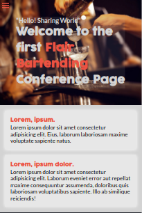
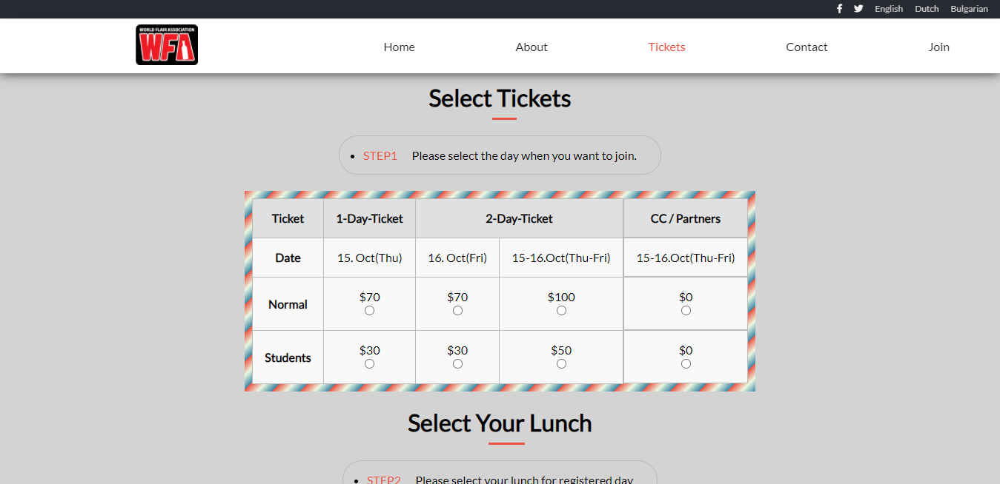
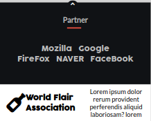
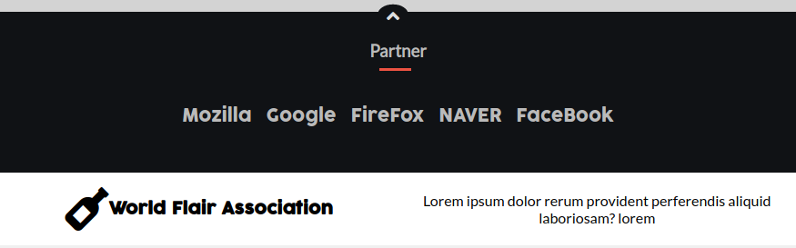

# World Flair Association

> This is a project where i created a conference page for flair bartending.

### Home Page
|  |  |
|:---:|:---:|
 
|  |  |
|:---:|:---:|
 
|  |  |
|:---:|:---:|
| Mobile view | Desktop view |

### About Page
|  |  |
|:---:|:---:|
 
|  |  |
|:---:|:---:|
| Mobile view | Desktop view |

### Ticket Page
|  |  |
|:---:|:---:|
| Mobile view | Desktop view |
### The Footer
|  |  |
|:---:|:---:|
| Mobile view | Desktop view |
## Built With

- HTML5, CSS3, JavaScript
- SASS

## Getting Started

To get a local copy up and running follow these simple example steps.
## Live Demo

[Live Demo Link](https://garciajordy.github.io/WFA-Conference-Platform/)

## Instructions
To get a local copy up and running follow these simple example steps.

### Setup
- Clone in the terminal or download this entire [GitHub Repo](https://github.com/garciajordy/WFA-Conference-Platform) and go to the index.html file.

### Install
- Set up liveserver as an extension in your VS Code.
- If you dont have the live server extension, or are using another software just view directly in your browser.

### Usage
- Right click and open the index.html in your browser to view.

## Authors

👤 **Jordy Garcia**

- GitHub: [@githubhandle](https://github.com/garciajordy)
- LinkedIn: [LinkedIn](https://www.linkedin.com/in/jordy-garcia-675849206/)

## 🤝 Contributing

Contributions, issues, and feature requests are welcome!

Feel free to check the [issues page](issues/).

## Show your support

Give a ⭐️ if you like this project!

## Acknowledgments

- Hat tip to Microverse
- Inspiration
- etc

## 📝 License

This project is [MIT](lic.url) licensed.
